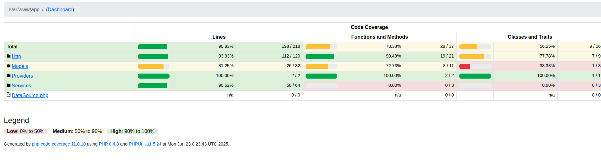

# News Aggregator

## Dependencies:

- docker [install guide](https://www.digitalocean.com/community/tutorials/how-to-install-and-use-docker-on-ubuntu-20-04)
- docker-compose [install guide](https://linuxhostsupport.com/blog/how-to-install-and-configure-docker-compose-on-ubuntu-20-04/)
- mysql [install guide](https://www.digitalocean.com/community/tutorials/how-to-install-mysql-on-ubuntu-20-04)
- php 8.2
- copy .env.example to .env & .env.testing and set the correct values
  
## Setup and run with docker:

```
docker-compose up -d --build
```
The app will be available at: http://localhost:8000

## To stop docker:

```
docker-compose down
```
## Run migrations

```
docker-compose exec app php artisan migrate
```
## API documentation swagger:
http://localhost:8000/api/documentation


## Postman collections with examples:
https://documenter.getpostman.com/view/46076791/2sB2xBDVva

## Regenerate swagger docs "only if you have changed the api":
```
php artisan l5-swagger:generate
```
## Setup and run with composer:
```
composer install
composer serve
```
## Check & fix lint: 
```
composer lint
``` 
## Run tests:
```
composer test
``` 
## Test coverage result:


## Security measures:
- All sensitive routes are protected with Laravel Sanctum authentication.
- Basic rate limiting is applied on API endpoints.
- XSS filtering is applied on input data.